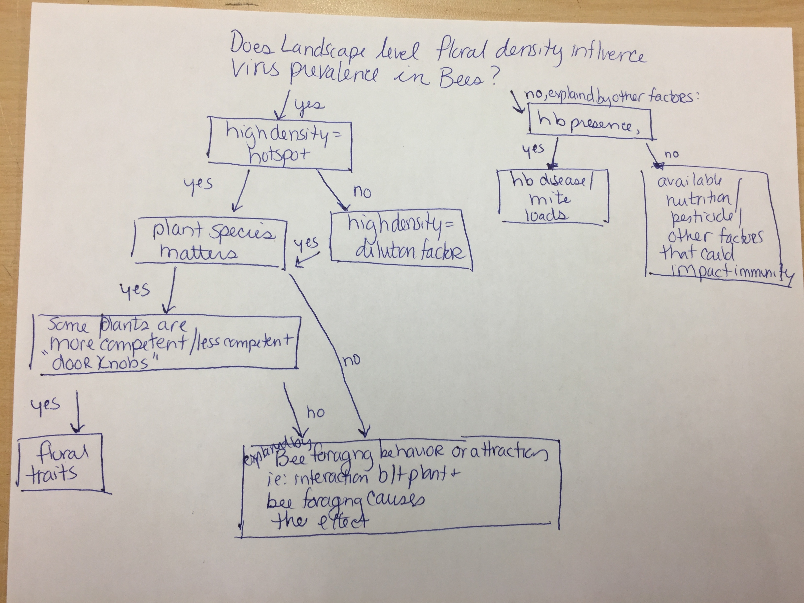
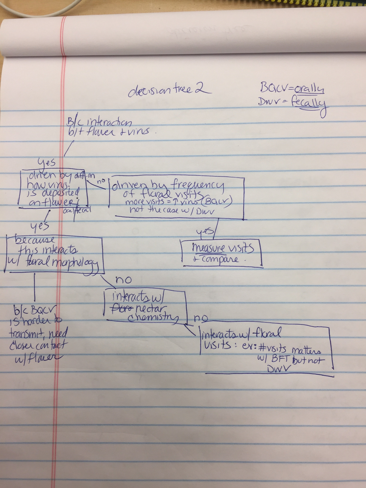
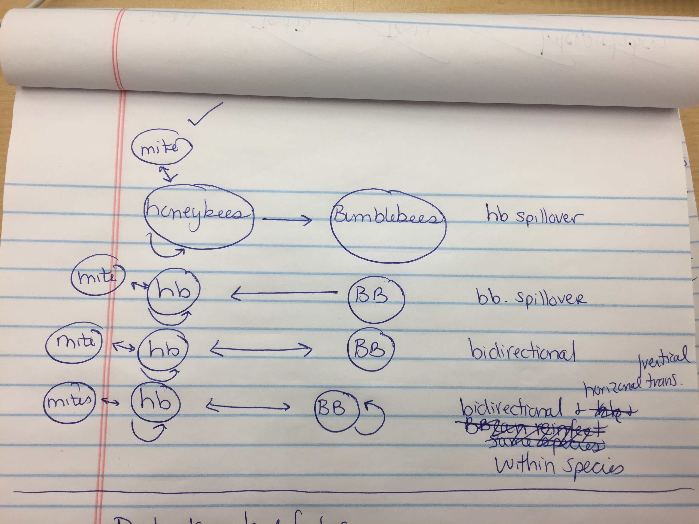
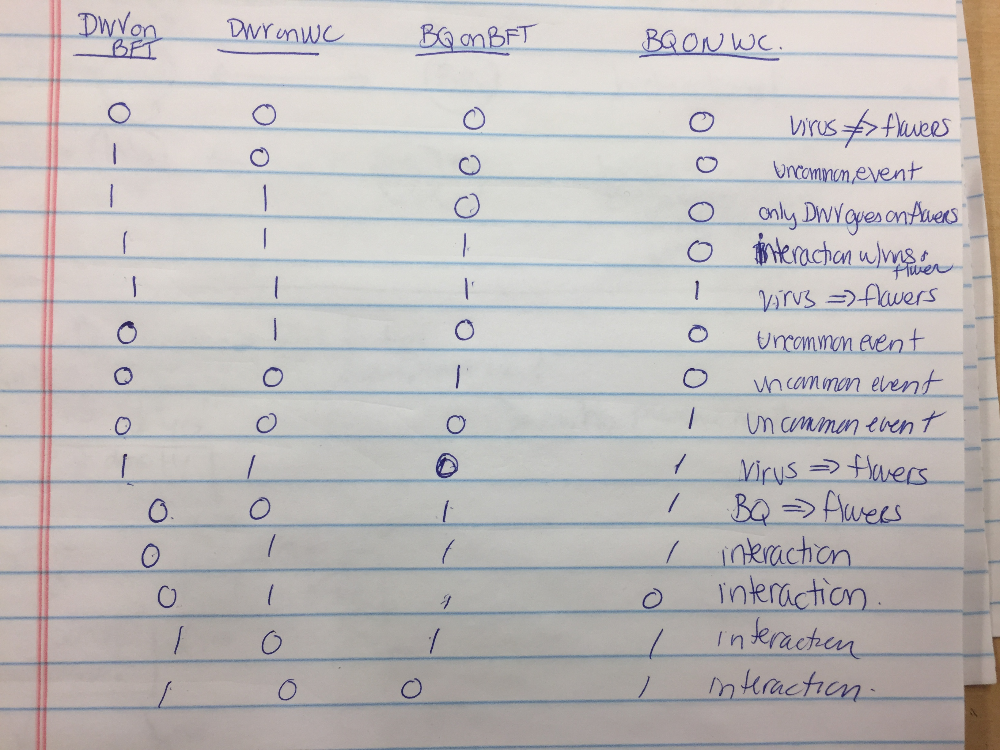
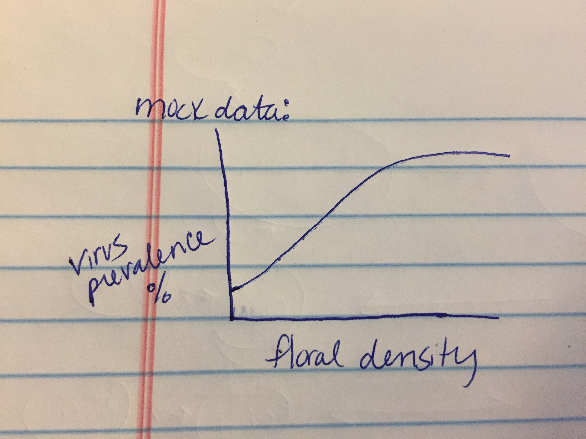

##Thinking on Paper...

*    

> Decision Tree # 1: Exploring how floral density on the landscape level influences prevalence of virus in bumble bees.

* 

> Decision Tree #2: Exploring possible explanations for why viruses and plant species are interacting.

* 

> Path Diagram: Exploring possible transmission routes and spillover between bumble bees, honey bees, and *Varroa* mites.

*    

> Dip Switch Diagram: Providing an explanation for the possible results for viral detection on flowers: (2 viruses, 2 plant species).

* 

> Mock Data: Relationship between viral prevalence (%) in bumble bees and floral density. I predict virus prevalence to be positively correlated with floral density. 