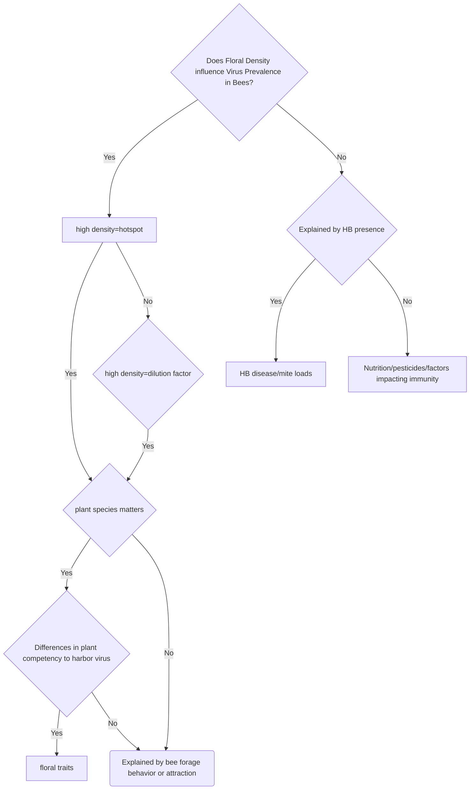

## Drawing Diagrams with Markdown

Samantha Alger

February 1, 2017

```mermaid
graph TD
A{Does Floral Density influence Virus Prevalence in Bees?}
    A-->|Yes| C[high density=hotspot]
    A -->|No| D{Explained by HB presence}
    D-->|Yes| E[HB disease/mite loads]
    D-->|No| F[Nutrition/pesticides/factors impacting immunity]
    C-->|Yes| G{plant species matters}
    C-->|No| H{high density=dilution factor}
    H-->|Yes| G
    G-->|Yes| I{Differences in plant competency to harbor virus}
    G-->|No| J(Explained by bee forage behavior or attraction)
    I-->|Yes|K[floral traits]
    I-->|No|J
    
```

