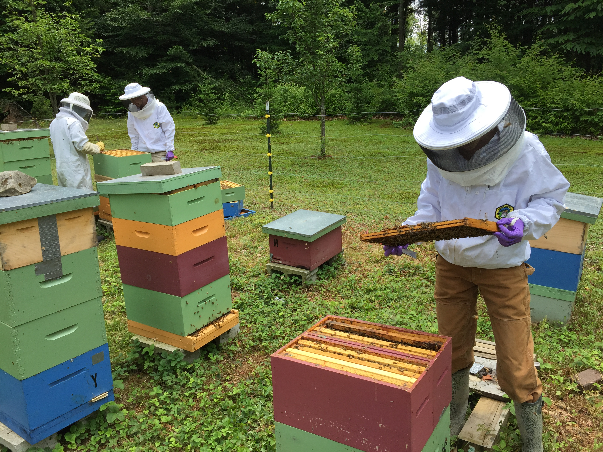

##Homework Assignments

* [Assignment 2](Assignment2.html)
* Assignment 3:
      * [Typora Flow Chart](Drawing_Diagrams_with_Markdown.html)
      * [PowerPoint](BeeVirusEcology.pdf)
      * [Beamer Presentation](BeamerPresentation.pdf)
* Assignment 4:
      * [MetaData](Homework4.html)
      * [Regular Expressions](RegularExpressions_HW4.html)
* [Assignment 5](homework5.html)
* [Assignment 6 & 7 (glossary)](GlossaryHW6.html)
* [Assignment 8](HW8_dataAnalysis.html)
* [Assignment 9](HW9_ApplyingFunctions.html)

##Other Resources

* [R Markdown Cheat Sheet](https://www.rstudio.com/wp-content/uploads/2015/02/rmarkdown-cheatsheet.pdf)
* [Lecture Notes](lecture_notes.html)

